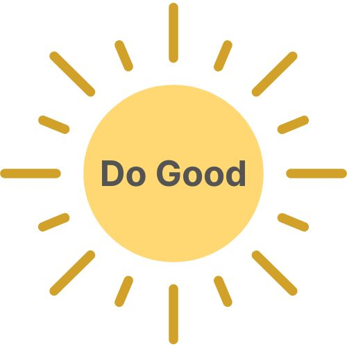
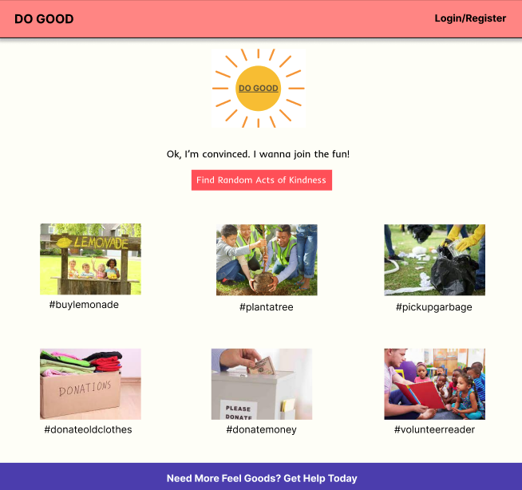
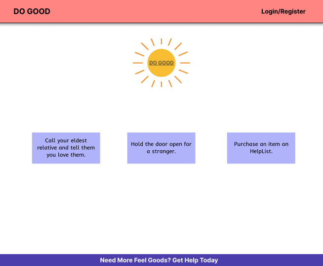
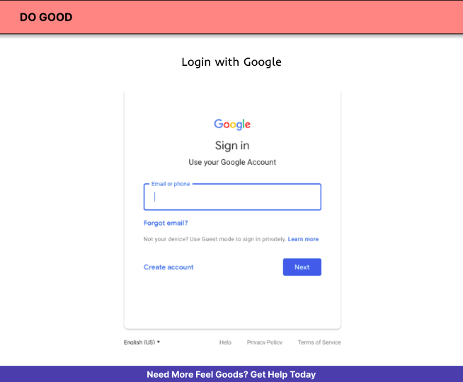
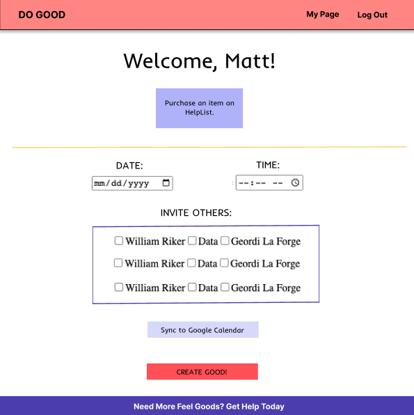
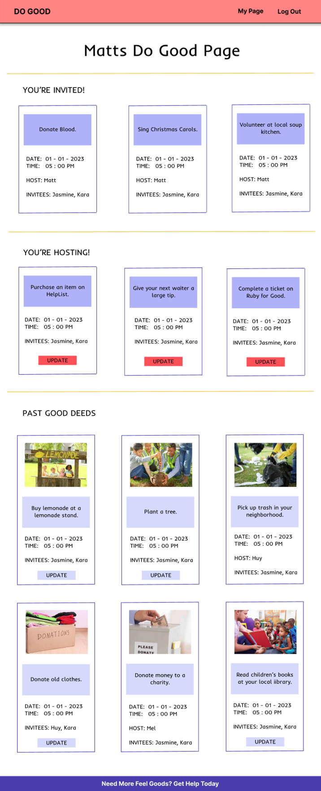
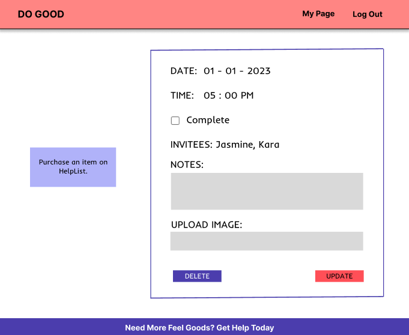
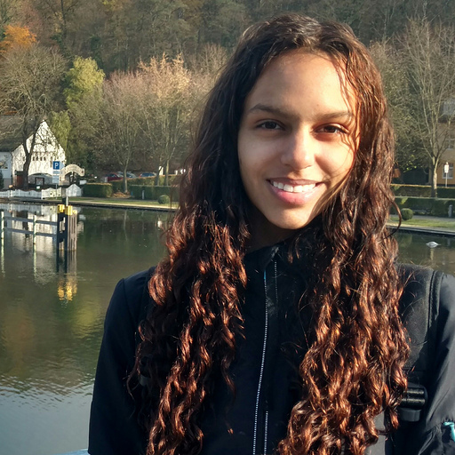
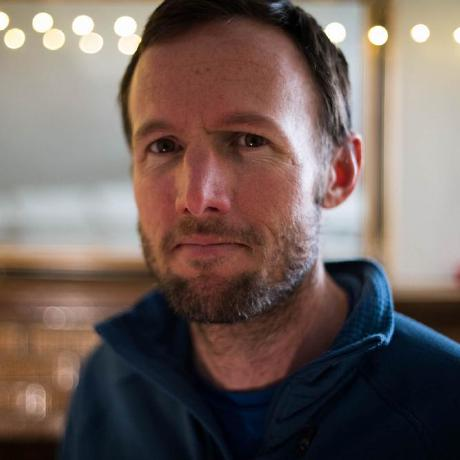

<!-- ReadMe -->

*README in progrss*

<!-- Opening -->
 

  

<h3 align="center">Welcome to Do Good</h3>
  

    Find the GOOD in the world.
    
 
    <section>
      With the constant bombardment of negative news, it's easy to think there is no good left in the world. Do Good aims to increase the good by connecting people with opportunities to complete random acts of kindness in an approachable and fun way.
    </section>
  

<!-- TABLE OF CONTENTS -->

  
Table of Contents

  <ol>
    <li>
      <a href="#about-the-project">About The Project</a>
      <ul>
        <li><a href="#built-with">Built With</a></li>
      </ul>
    </li>
    <li>
      <a href="#getting-started">Getting Started</a>
      <ul>
        <li><a href="#prerequisites">Prerequisites</a></li>
        <li><a href="#testing">Testing</a></li>
        <li><a href="#wire_frames">Wire Frames</a></li>
        <li><a href="#technologies"> Technologies Used</a></li>
      </ul>
    </li>
    <li><a href="#refactor">Future Iterations</a></li>
    <li><a href="#contact">Contributors</a></li>
  </ol>

<!-- ABOUT THE PROJECT -->
## About The Project

   ☀️ [Production Website](https://cryptic-fortress-66693.herokuapp.com/)
    
   ☀️ [Backend Service](https://warm-temple-59633.herokuapp.com/)
    
   ☀️ [Backend Repository](https://github.com/do-good-2211/do_good_api)

   <!-- * [Video Presentation]() -->

  **Do Good** was created by Back End students at Turing School of Software and Design as their [consultancy project](https://backend.turing.edu/module3/projects/consultancy/).

  The mission of **Do Good** is to provide users with convenient access to positivity and an opportunity to be part of the good in the world.

  Users simply click the "Find a Random Act of Kindness" button and are presented with 3 random acts to choose from. Once chosen, they schedule the "good deed" and it gets added to their dashboard. Users are able to invite others to join in on the fun as well as add it to their calendars because, let's be real, life can get hectic.

  For visitors who aren't ready to jump into completing an act, they can browse our library of kind act photos for the feel-goods.

(<a href="#readme-top">back to top</a>)

<!-- Built With -->
### Built With
 

 

(<a href="#readme-top">back to top</a>)

<!-- GETTING STARTED -->

## Getting Started

If you'd like to demo this API on your local machine:
 

### Prerequisites
* Ensure you have the prerequisites

### Backend  Repository
* Clone the backend repo: `git clone git@github.com:do-good-2211/do_good_api.git`
* Navigate to the root folder: `cd do_good_api`
* Run: `bundle install`
* Run: `rails db:{create,migrate}`
* Inspect the `/db/schema.rb` and compare to the 'Schema' section below to ensure migration has been done successfully
* Run: `rails s`

### Frontend  Repository
* Clone this repo: `git clone git@github.com:do-good-2211/do_good_web.git`
* Navigate to the root folder: `cd do_good_web`
* Run: `bundle install`
* Run: `rails db:{create}`
* Visit http://localhost:5000/

<!-- Prerequisites -->
### Prerequisites

- Ruby Version 3.1.1
- Rails Version 7.0.4.x
- Bundler Version 2.4.9

<!-- Testing -->
## Testing

To test the entire spec suite, run `bundle exec rspec`.
*All tests should be passing.*

Happy path, sad path, and edge testing were considered and tested. When a request cannot be completed, an error message is returned at the top of the page.

(<a href="#readme-top">back to top</a>)

<!-- Wire Frames -->
### Wire Frames

  
<code>Route: "/"</code>

  Landing Page:
  <pre>
    <code>
      
    </code>
  </pre>

  
<code>Route: "/random_acts"</code>

  Random Acts Page:
  <pre>
    <code>
      
    </code>
  </pre>

  
<code>Route: "/login"</code>

  Login/Register Page: (Google login window will appear after link is clicked)
  <pre>
    <code>
      
    </code>
  </pre>

  
<code>Route: "/good_deeds/new"</code>

  New Good Deed Form Page:
  <pre>
    <code>
      
    </code>
  </pre>

  
<code>Route: "/dashboard"</code>

  User's Show Page:
  <pre>
    <code>
      
    </code>
  </pre>

  
<code>Route: "/good_deeds/:id/edit"</code>

  Good Deed's Edit & Delete Page:
  <pre>
    <code>
      
    </code>
  </pre>

(<a href="#readme-top">back to top</a>)

<!-- Technologies Used -->

### Technologies Used

[Google Cloud Platform](https://cloud.google.com/) was used to allow users to sign in with their Google account.

  
 <strong>Google OAuth</strong>
 
  
Signing in to the Do Good app is made simple by allowing users to sign in with google. 

  
  More information on the gem used for this(`omniauth-google-oauth2`) can be found [here](https://github.com/zquestz/omniauth-google-oauth2)

 

[Amazon Web Services](https://aws.amazon.com/) was used to allow users to upload photos for their completed good deeds.

  
<strong>Amazon S3 Cloud Object Storage</strong>
 
  
By including amazon's web serfice for storage, we can allow users to upload their pictures which are then saved as objects in a "bucket".  

  More information on the gem used for this(`aws-sdk-s3`) can be found [here](https://github.com/aws/aws-sdk-ruby)

 

[Google Calendar API](https://developers.google.com/calendar/api/guides/overview) was used to create a calendar event on the user's Google Calendar.

  
<strong> Events</strong>
 
    
Users can see their google calendar on their dashboard. Each of their good deeds will display on the dates they have a deed scheduled. 

 

[Tailwind CSS](https://tailwindcss.com/) was used for styling

(<a href="#readme-top">back to top</a>)

<!-- Future Iterations -->

<h2 id="refactor">Future Iterations</h2>
<!-- <li></li>
<li></li> -->

  
Possible Features

    <dl>
      <dt>Idea 1</dt>
        <dd>- Stuff bit 1</dd>
        <dd>- Stuff bit 2</dd>
      <dt>Idea 2</dt>
        <dd>- Stuff bit 1</dd>
        <dd>- Stuff bit 2</dd>
      <dt>Upload Video/Multiple Media</dt>
        <dd>- Users can can upload both images and videos</dd>
        <dd>- Stuff bit 2</dd>
      <dt>Stories of Good</dt>
        <dd>- Users can share stories of good that happened to them</dd>
      <dt>Find good/opportunities</dt>
        <dd>- Users can find where to do good in their area</dd>
      <dt>Badges and points</dt>
        <dd>- Users can earn points and badges for their good deeds</dd>
      <dt>User Metrics</dt>
        <dd>- Users can see their own metrics</dd>
        <dd>- Users can see a library of their deed history</dd>
    </dl>
  

(<a href="#readme-top">back to top</a>)

<!-- CONTACT -->
## Contributors

|  |  |  |  |  |  |
| ------------------ | ------------ | -------------- | ----------- | -------------- | ----------- |
| Huy Phan | Jasmine Hamou | Kara Jones-Hofmann | Matt Enyeart | Melony Erin Franchini | Mike Dao |
| Collaborator | Collaborator | Collaborator | Collaborator | Collaborator | Project Manager |
| [GitHub](https://github.com/HuyPhan2025) | [GitHub](https://github.com/hamouj) | [GitHub](https://github.com/KaraJoHo) | [GitHub](https://github.com/menyeart) | [GitHub](https://github.com/MelTravelz) | [GitHub](https://github.com/mikedao) |
| [LinkedIn](https://www.linkedin.com/in/huy-phan-2471b3261/) |  [LinkedIn](https://www.linkedin.com/in/jasmine-hamou/) | [LinkedIn](https://www.linkedin.com/in/81012911-91208/) | [LinkedIn](https://www.linkedin.com/in/matt-enyeart/) | [LinkedIn](https://www.linkedin.com/in/melony-erin-franchini/) | [LinkedIn](https://www.linkedin.com/in/michaeldao/) |

(<a href="#readme-top">back to top</a>)

